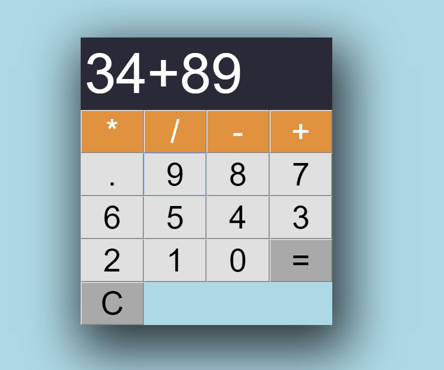

# Calculator

This app was creted using vanilla JavaScript, HTML and CSS. The user can input different values and the results are rendered through Javascript functions and displayed on the screen.

# [DEMO](https://my-calculator1.netlify.com/)

# Technologies
* Javascript
* HTML
* CSS